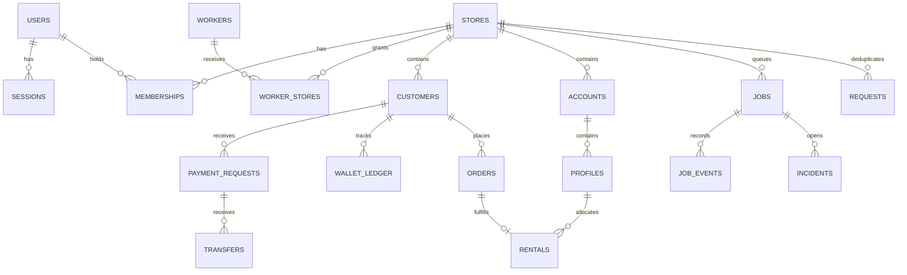

# Implemented schema

```mermaid
erDiagram
    USERS ||--o{ SESSIONS : has
    USERS ||--o{ MEMBERSHIPS : holds
    STORES ||--o{ MEMBERSHIPS : has
    STORES ||--o{ WORKER_STORES : grants
    WORKERS ||--o{ WORKER_STORES : receives
    STORES ||--o{ CUSTOMERS : contains
    STORES ||--o{ ACCOUNTS : contains
    ACCOUNTS ||--o{ PROFILES : contains
    CUSTOMERS ||--o{ PAYMENT_REQUESTS : receives
    PAYMENT_REQUESTS ||--o{ TRANSFERS : receives
    CUSTOMERS ||--o{ WALLET_LEDGER : tracks
    CUSTOMERS ||--o{ ORDERS : places
    ORDERS ||--o| RENTALS : fulfills
    PROFILES ||--o{ RENTALS : allocates
    STORES ||--o{ JOBS : queues
    JOBS ||--o{ JOB_EVENTS : records
    JOBS ||--o{ INCIDENTS : opens
    STORES ||--o{ REQUESTS : deduplicates
```

